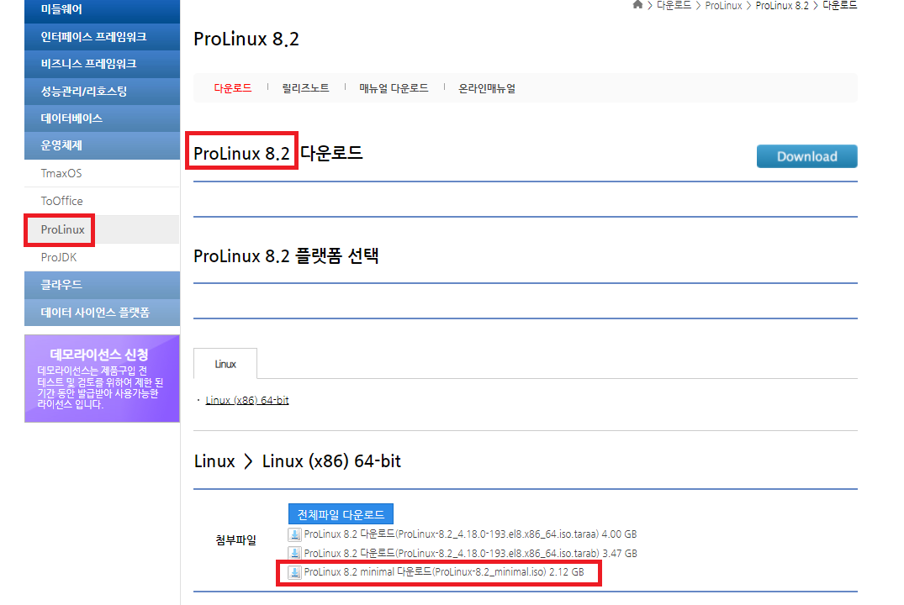
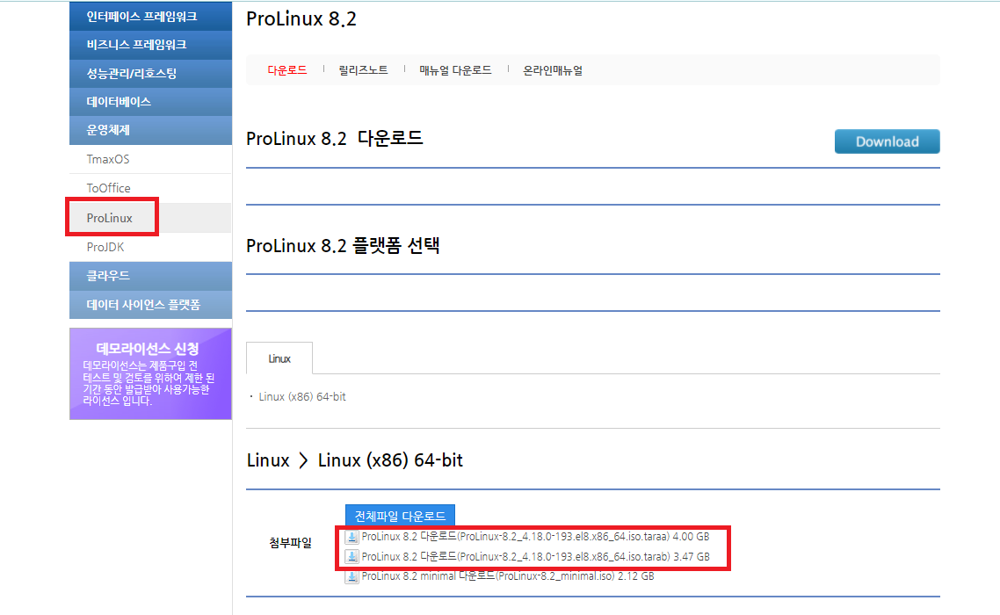
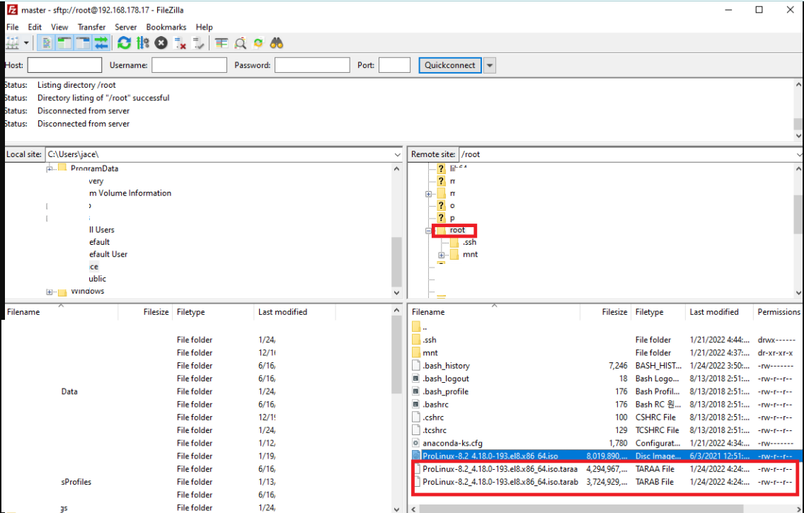
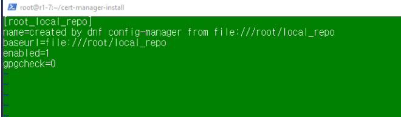
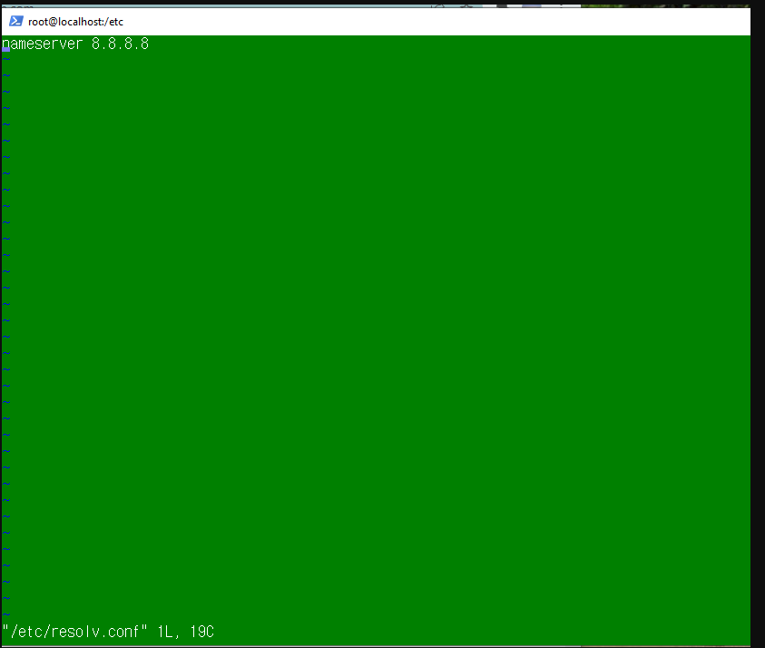

# Package Repo 구축 및 사용 가이드


`[OS설치부분/생략가능]`

----

### Pro linux 8.2 설치
- Prolinux ISO설치후  기본적인 서버 세팅을 진행합니다 (vm 세팅)
    


- Prolinux 파일다운
    


### Filezilla를 이용해 파일 복사

- 서버에 원격 연결한 후 파일 업로드
    


- 다운받은 iso파일 압축 해제

    ```bash
    # cat {압축파일명}.tar* | tar xvf -
    # root에 prolinux.iso가 있다고 가정

    cat ProLinux-8.2_4.18.0-193.el8.x86_64.iso.tar* | tar xvf -

    ```

- 단순히 iso만 복사한 경우, usb의 iso를 복사한 후 iso 안의 기본 레포를 로컬로 복사합니다. (.repo가 1개이상이면 레포 위치를 인식 못함)


    ```bash
    cd ~
    mkdir ./mnt

    # 일단은 배정받은 서버에는 진행하지 않았음
    # mount /dev/sda1 ./mnt

    # iso파일을 linux로 가져옵니다
    # 파일이 있는곳에서 ./ProLinux.iso ./mnt

    cd /home/jjh/
    cp ProLinux-8.2_4.18.0-193.el8.x86_64.iso /root/
    mount /root/ProLinux-8.2_4.18.0-193.el8.x86_64.iso ./mnt

    cp -rT ./mnt/BaseOS ./BaseOS
    cp -rT ./mnt/AppStream ./AppStream

    ```

### repo 설정 변경

- 기존 레포가 존재할 시 비활성화
    ```bash
    cd /root
    export LOCAL_REPO_ROOT=$PWD
    dnf config-manager --set-disabled BaseOS
    dnf config-manager --set-disabled AppStream

    ```

- 레포 신규 추가

    ```bash
    # 레포의 존재를 확인합니다
    yum repolist 

    dnf config-manager --add-repo file://${LOCAL_REPO_ROOT}/BaseOS
    dnf config-manager --add-repo file://${LOCAL_REPO_ROOT}/AppStream

    ```


- repo를 신규 생성

    ```bash
    #/etc/yum.repos.d/ 파일안에는 새로만들 .repo(ex. Prolinux.repo는 삭제) 파일말고 아무것도 없어야함
    cd /etc/yum.repos.d/


    # root_AppStream.repo, root_BaseOS.repo에 gpgcheck 추가
    gpgcheck=0 


    # 정상동작 확인
    yum update
    yum repolist

    ```


- `[비고]` azure에서 레포를 등록할 경우 
    
    ```bash
    # No such command: config-manager. Please use /usr/bin/dnf --help 에러가 발생시 설치 진행
    yum install -y dnf
    dnf install -y dnf-plugins-core

    ```


----
`[여기부터 시작]` - `외부 폐쇄망이라면 일단 위에 yumrepo를 잡아주는것 부터 `

## 구성 요소 및 버전

## 폐쇄망 구축 가이드
### 1. 필요한 패키지를 다운
```bash
    cd ~
    git clone https://github.com/learncloud/build-local-repo-prolinux8.2.git

    # OR
    # scp -r ck-ftp@192.168.1.150:/home/ck-ftp/k8s_package/el8/redhat ./local_repo

```

추가적으로 필요한 패키지가 있으면 해당 디렉토리로 다운받거나 복사합니다.


### 2. local\_repo 디렉토리를 로컬 레포를 구축할 노드로 이동
- tar 압축
```bash
tar cvzf local_repo.tar.gz local_repo

```

- tar 압축해제
```bash
tar xvzf local_repo.tar.gz

```

- createrepo_c 설치
```bash
# 설치가 안되면 namerserver가 없어서 그런것이니 설정해주자
dnf localinstall ./common/createrepo/*.rpm

```


### 3. 패키지들이 있는 디렉토리에 repo를 생성
압축 해제한 디렉토리 기준
```bash
pushd ./local_repo
createrepo_c ./
modifyrepo_c modules.yaml ./repodata
export LOCAL_REPO_PATH=$PWD
popd

```


### 4. 노드에 local repo를 추가
```bash
dnf config-manager --add-repo file://${LOCAL_REPO_PATH}

#repo 확인
sudo dnf repolist
sudo yum list

```

- Repo에 각종 설치를 할 수 있도록 사전 작업을 진행(이미 위에서 진행함) 

    * `/etc/yum.repos.d/root_AppStream.repo`

    * `/etc/yum.repos.d/root_BaseOS.repo` 

    * `/etc/yum.repos.d/root_local_repo.repo`

     * 모든 REPO에  `gpgcheck=0` 추가
        
        
        

    
        

    * nameserver 생성
        


